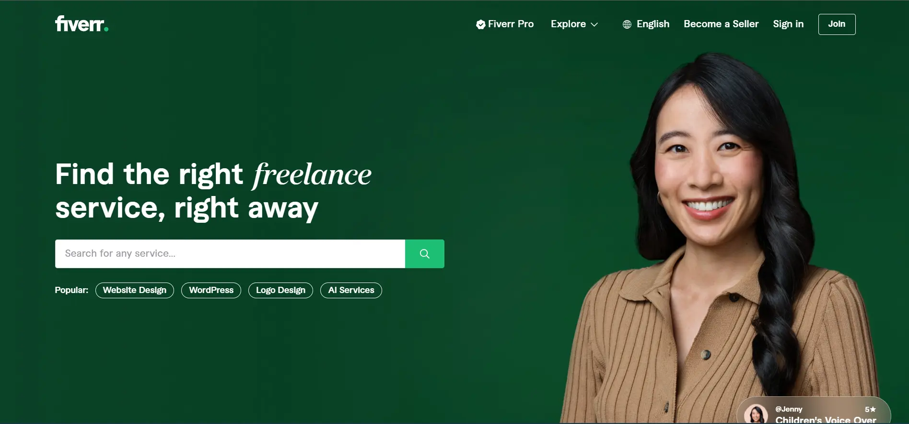

# Fiverr

-  Designed a full-stack app with &lt; 1s LCP, engaging UI, and 98% uptime using React, SCSS, Node.js, and Mongoose.

## Live Demo

Check out the live demo of this app [here](https://fiverr-harsh.vercel.app/).



## Description

- Engineered a full-stack web application, Fiverr, achieving a Largest Contentful Paint (LCP) of less than 1 second for enhanced user experience.

- Designed an engaging UI using React and SCSS, improving user interaction and usability.

- Implemented server-side functionality with Node.js and Mongoose, maintaining 98% uptime for optimal performance.

## Technologies Used

- React JS
- Node JS
- Express JS
- MongoDB
- Mongoose
- JWT
- SCSS

### Clone and Run

1. Clone the repository:

```bash
git clone https://github.com/harsh-sangwan2003/fiverr
```

2. Navigate to the project directory:

```bash
cd client
```

3. Install dependencies and start the development server:

```bash
npm install && start
```

4. Open your browser and navigate to http://localhost:3000 to view the app.

## Contributions

Contributions are welcome! Please fork the repository and submit a pull request with your changes.